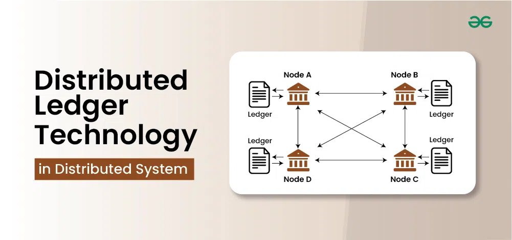

# Module 1: Introduction to Blockchain Technology

---

<details>
<summary><strong>What is Blockchain?</strong></summary>

- Blockchain is a decentralized, distributed ledger technology that records transactions across a network of computers.
  
- Key components of blockchain [(hash, blocks, chains, nodes, miners, ledgers)](https://andersbrownworth.com/blockchain/hash)
- Difference between blockchain and traditional databases.

</details>

<details>
<summary><strong>Key Characteristics of Blockchain</strong></summary>

- **Decentralization**: No central authority; operates on a peer-to-peer network.
- **Immutability**: Once recorded, data cannot be altered or deleted.
- **Transparency**: Transactions are publicly visible on the ledger.
- **Security**: Uses cryptographic encryption and hashing to ensure data integrity.
- **Consensus Mechanisms**:
  - **Proof of Work (PoW)**: Requires computational power to solve cryptographic puzzles and validate transactions. Example: **Bitcoin**.
  - **Proof of Stake (PoS)**: A mechanism where participants (validators) are chosen to create new blocks and validate transactions based on the number of tokens they hold and are willing to "stake" as collateral. Example: **Ethereum 2.0**.

</details>

<details>
<summary><strong>Types of Blockchains</strong></summary>

- **Public Blockchains**: Open to anyone, fully decentralized.
  - Example: **Bitcoin, Ethereum**.
- **Private Blockchains**: Restricted access, controlled by a single entity.
  - Example: **Hyperledger, Corda**.
- **Consortium Blockchains**: Partially decentralized, governed by multiple organizations.
  - Example: **R3 Corda (banking), Quorum (enterprise solutions)**.

</details>

<details>
<summary><strong>Blockchain Use Cases</strong></summary>

- Cryptocurrencies.
- DeFi (Decentralized Finance).
- NFTs (Non-Fungible Tokens).
- Supply chain management.
</details>

---

## **Accounts, Wallets, Private Keys & Public Keys in Blockchain**

<details>
<summary><strong>What is a Blockchain Account?</strong></summary>

- A **blockchain account** is an entity that can send, receive, and store assets.
- There are two types:
  - **Externally Owned Accounts (EOAs)**: Controlled by private keys. Example: MetaMask, Trust Wallet.
  - **Smart Contract Accounts**: Controlled by code, without a private key.

</details>

<details>
<summary><strong>What is a Wallet?</strong></summary>

- A **wallet** is a tool (software/hardware) that:
  - Generates & stores **private keys** securely.
  - Signs transactions using the **private key**.
  - Displays **public wallet addresses** for receiving assets.
- Example Wallets: **MetaMask, Ledger, Trust Wallet, MyEtherWallet**.

</details>

<details>
<summary><strong>Private Key, Public Key, and Wallet Address</strong></summary>

### **🔹 Private Key**

- A randomly generated 256-bit number that controls blockchain funds.
- **Used for:** Signing transactions & proving ownership.
- **Must be kept secret** – If stolen, funds are lost forever.
- **Example Private Key:**
  ```
  0x4c0883a69102937d6231471b5dbb6204fe51296170827948b2c7d6e003dd9c58
  ```

### **🔹 Public Key**

- Derived from the private key using **Elliptic Curve Cryptography (ECC)**.
- **Used for:** Verifying digital signatures.
- **Publicly visible**, but cannot be used to control funds.
- **Example Public Key:**
  ```
  0x041c8dc0df0b3a7c2268121e839ad4a5cd4f7e9de245432b27f8cb3b5af4b5e
  ```

### **🔹 Wallet Address**

- Derived from the **public key** using **Keccak-256 hashing**.
- The last **20 bytes** of the hash form the address.
- **Example Wallet Address:**
  ```
  0x742d35Cc6634C0532925a3b844Bc454e4438f44e
  ```

| Feature    | Private Key  | Public Key       | Wallet Address  |
| ---------- | ------------ | ---------------- | --------------- |
| Secret?    | Yes          | No               | No (Public)     |
| Used For   | Signing      | Verification     | Receiving Funds |
| Length     | 64 hex chars | 128 hex chars    | 40 hex chars    |
| Derivation | Random       | From Private Key | From Public Key |

</details>

---

🔙 [Back to Main Index](index.md)
